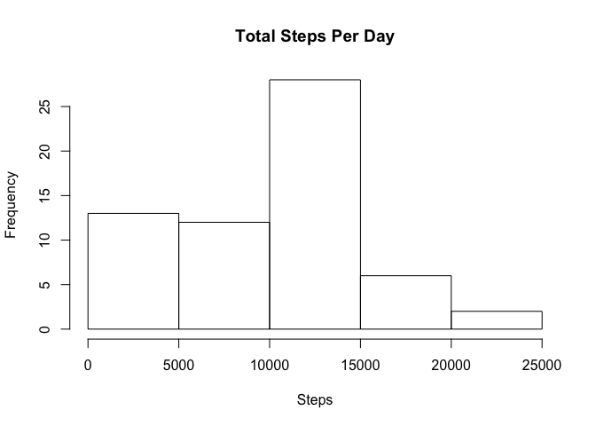
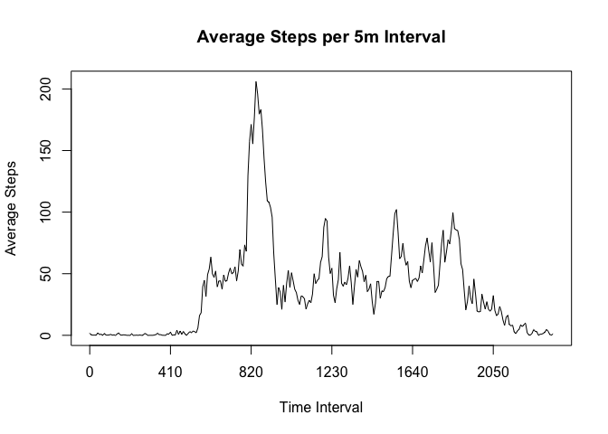
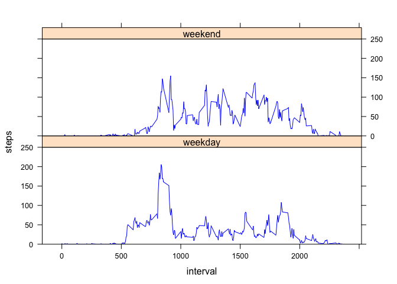

# Reproducible Research: Peer Assessment 1
This assignment makes use of data from a personal activity monitoring device. This device collects data at 5 minute intervals through out the day. The data consists of two months of data from an anonymous individual collected during the months of October and November, 2012 and include the number of steps taken in 5 minute intervals each day.

## Loading and preprocessing the data
The dataset is stored in a CSV file. It contains 17,568 observations of three variables: steps, date, and time interval.


```r
activity <- read.csv("activity.csv", header = T, quote = "\"", na.strings = "NA", strip.white = T, colClasses = c("numeric", "Date", "numeric"))
```
## What is mean total number of steps taken per day?
The `split` function together with `sapply` can be used to calculate total steps per day.

```r
stepsPerDay <- sapply(split(activity$steps, activity$date), sum, na.rm = T)
hist(stepsPerDay, main = "Total Steps Per Day", xlab = "Steps")
```

 

```r
mean(stepsPerDay)
```

```
## [1] 9354.23
```

```r
median(stepsPerDay)
```

```
## [1] 10395
```

## What is the average daily activity pattern?
The average daily step pattern can be found using a similar method.

```r
averageStepPerInterval <- sapply(split(activity$steps, activity$interval), mean, na.rm = T)
plot(averageStepPerInterval, type = "l", main = "Average Steps per 5m Interval", xaxt = "n", ylab = "Average Steps", xlab = "Time Interval")

#create a custom variable to denote time interval on the x axis
xticks <- seq(to = length(averageStepPerInterval), by = 50)
axis(1, at = xticks, labels = names(averageStepPerInterval)[xticks])
```

 

```r
#find max average value of steps per time interval
max(averageStepPerInterval)
```

```
## [1] 206.1698
```

```r
#print corresponding time interval
names(which(averageStepPerInterval == max(averageStepPerInterval)))
```

```
## [1] "835"
```

## Imputing missing values
To impute missing step values, the median across all days for the same interval will be used in place of a NA value.


```r
intervalMedians <- sapply(split(activity$steps, activity$interval), median, na.rm = T)
missingValues <- which(is.na(activity))

activityImputed <- activity

for(v in missingValues) {
    interval <- activityImputed[v,"interval"]
    activityImputed[v,"steps"] <- intervalMedians[as.character(interval)]
}

#calculate total, mean, and median steps per day as before to compare originial dataset to the new dataset with imputed values
stepsPerDayImputed <- sapply(split(activityImputed$steps, activityImputed$date), sum, na.rm = T)
hist(stepsPerDayImputed, main = "Total Steps Per Day", xlab = "Steps")
```

 

```r
mean(stepsPerDayImputed)
```

```
## [1] 9503.869
```

```r
median(stepsPerDayImputed)
```

```
## [1] 10395
```
The median of steps per day for the new data set with imputed values is about 150 steps above the original dataset. No new data was added, so it is not a surprise that the median is unchanged.

## Are there differences in activity patterns between weekdays and weekends?
First the dates for the data are classified as either weekday or weekend.

```r
activityImputed$dayType <- ifelse((weekdays(activityImputed$date) == "Saturday" | weekdays(activityImputed$date) == "Sunday"), "weekend", "weekday")
```
The `xyplot` function in the Lattice package can use the new dayType factor to show average steps partitioned by both time intervals and day type.


```r
require(lattice)
```

```
## Loading required package: lattice
```

```r
xyplot(steps ~ interval | dayType, layout = c(1,2), data = activityImputed, col = "BLUE", scales = list(y=list(at=seq(0,250,by=50), limits = c(0,250))), panel = function(x, y, ...) {
    panel.average(x, y, horizontal = FALSE, ...)
})
```

 


